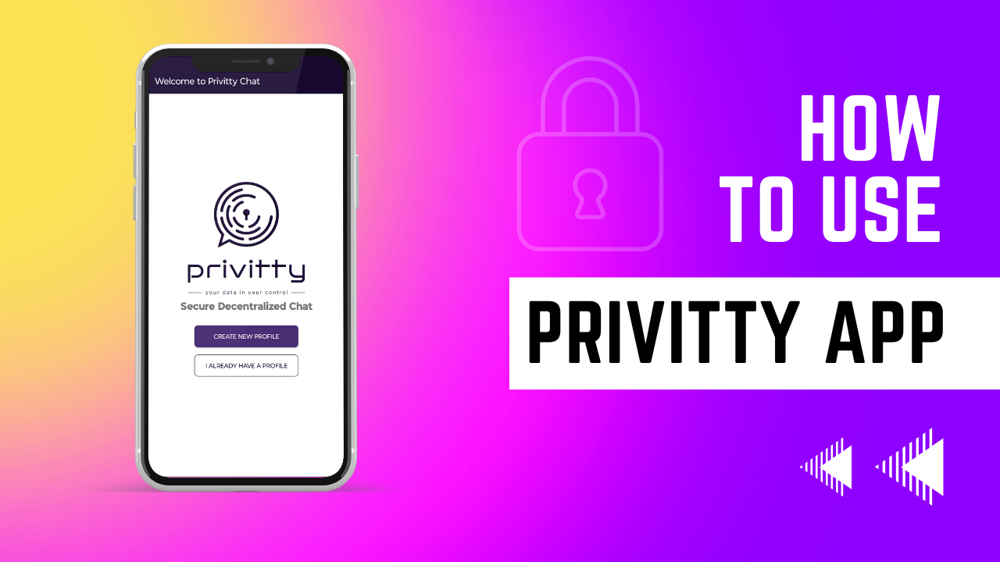

## [Privitty](https://privittytech.com), built on [Delta Chat](https://get.delta.chat)—instant, interoperable, privacy-preserving messaging with granular control.


Share securely, revoke anytime, from one or all peers. For details how it avoids storing personal information please see our [privacy policy](privacy.html) 

Welcome to the default onboarding server ({{ config.mail_domain }}) 
for Delta Chat users.  For details how it avoids storing personal information
please see our [privacy policy](privacy.html). 


<a class="cta-button" href="DCACCOUNT:https://{{ config.mail_domain }}/new">Get a {{config.mail_domain}} chat profile</a>

If you are viewing this page on a different device
without a Privitty Chat app,
you can also **scan this QR code** with Privitty Chat:

🐣 **Choose** your Avatar and Name

💬 **Start** chatting with any Privitty Chat contacts using [QR invite codes](https://delta.chat/en/help#howtoe2ee)



Note: this is only a temporary development chatmail service



## Privitty, we’re redefining data security by giving users a choice—a real choice:

🔒 **Presentation Layer Security Mode:** Only the intended recipients can view the data.

🚫 **True Revoke Mode:** Wherever your data travels, no matter where it’s stored, you can instantly make it inaccessible, ensuring compliance is baked in.

Our solution isn’t more locks on the doors; it’s building a door that only you control.

We’re not just adding extra layers of security; we’re enabling users to control their data with certainty. At Privitty, we believe security should be proactive, not reactive. In an era where trust is the most valuable currency, losing control of your data isn’t an option.

---

<strong>How to use Privitty</strong>

Share securely, revoke anytime, from one or all peers. For details on how it avoids storing personal information, please see our <a href="privacy.html">privacy policy</a>.

<ol>
  <li>Send a "Hello" message to the peer.</li>
  <li>This will initiate Privitty security.</li>
</ol>

