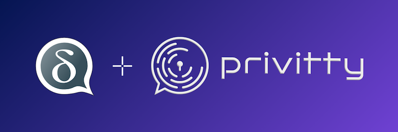
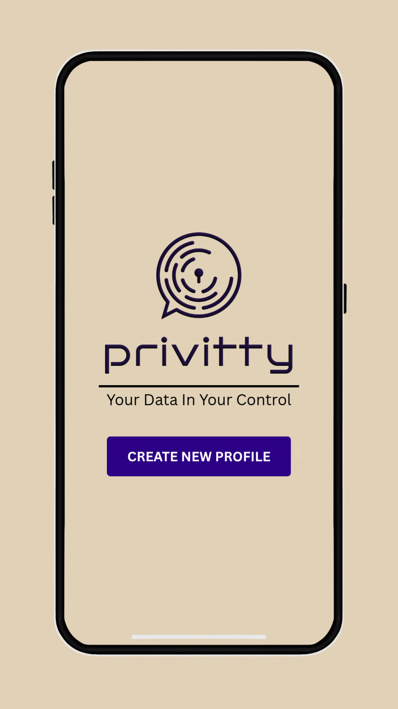

<!-- Google tag (gtag.js) -->

## [Privitty](https://privittytech.com), built on [Delta Chat](https://get.delta.chat)—instant, interoperable, privacy-preserving messaging with granular control.


Share securely, revoke anytime, from one or all peers. For details how it avoids storing personal information please see our [privacy policy](privacy.html) 

Welcome to the default onboarding server ({{ config.mail_domain }}) 
for Delta Chat users.  For details how it avoids storing personal information
please see our [privacy policy](privacy.html). 


<a class="cta-button" href="DCACCOUNT:https://{{ config.mail_domain }}/new">Get a {{config.mail_domain}} chat profile</a>

If you are viewing this page on a different device
without a Privitty Chat app,
you can also **scan this QR code** with Privitty Chat:

🐣 **Choose** your Avatar and Name

💬 **Start** chatting with any Privitty Chat contacts using [QR invite codes](https://delta.chat/en/help#howtoe2ee)



Note: this is only a temporary development chatmail service



 

 
<h2>Privitty, we’re redefining data security by giving users a choice—a real choice:</h2>

   

       
🔒 <strong>Presentation Layer Security Mode:</strong> Only the intended recipients can view the data.

       
🚫 <strong>True Revoke Mode:</strong> Wherever your data travels, no matter where it’s stored, you can instantly make it inaccessible, ensuring compliance is baked in.

       
Our solution isn’t more locks on the doors; it’s building a door that only you control.

       
We’re not just adding extra layers of security; we’re enabling users to control their data with certainty. At Privitty, we believe security should be proactive, not reactive. In an era where trust is the most valuable currency, losing control of your data isn’t an option.

   

   <video style="max-width: 230px;" controls preload="none" muted autoplay poster="./IN-APP-DEMO-WITHOUT-BG.jpg">
 <source src="./Privitty-Demo-Without-BG.mp4" type="video/mp4">
 Your browser does not support the video tag.
</video>

 

 

 
<h2>How to get Privitty</h2>

Getting started with Privitty Chat is simple and secure. Follow the steps below to join our privacy-first messaging experience:

<h4>🛠 Step 1: Prepare Your Phone</h4>

Make sure your phone is connected to the internet and ready to install apps from the Google Play Store.

<h4>📲 Step 2: Scan the QR Code</h4>

Use your phone’s camera or any QR scanner app to scan the QR code below.

 <!-- Insert your QR code image here -->  

<h4>🚀 Step 3: Download from Play Store</h4>

You’ll be redirected directly to our Google Play Store page. Tap Install to download Privitty Chat.

<h4>✅ Step 4: Sign Up & Start Chatting</h4>

Open the app, create your secure account, and start chatting with total privacy.

   

